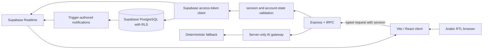

# Brikouli — Final Production Architecture

## Purpose and scope

Brikouli is an Arabic-first, right-to-left marketplace for local short-term work. Phase 10 keeps the established **React 19 + Vite + Express + tRPC + Supabase** architecture. It does not introduce a second backend, migrate the product to Next.js, or move trust decisions into the browser.

| Layer | Production responsibility | Security boundary |
| --- | --- | --- |
| React 19 client | Arabic RTL interface, accessible route shells, MapLibre discovery, responsive navigation, optimistic UI and Realtime invalidation. | Contains no Supabase service-role or AI credentials. |
| Vite build | Static SPA assets, route chunks, public `robots.txt`, `sitemap.xml`, and manifest. | Public pages are indexable; private routes are blocked from crawlers and protected at runtime. |
| Express + tRPC | Typed server procedures, request/session context, input validation, AI gateway and safe logging. | `supabaseProcedure` validates a live session and account state; `supabaseAdminProcedure` adds verified administrator status. |
| Supabase Auth | Identity, email confirmation and session issuance. | Auth configuration remains a project-owner control plane responsibility. |
| Supabase PostgreSQL | Profiles, gigs, applications, messages, notifications, search events, trust, audits and administrative data. | Row-level security and ownership/admin-checked SQL functions are the final authorization boundary. |
| Supabase Realtime | Owned-message and owned-notification cache invalidation. | Publication and table RLS restrict data delivery to permitted rows. |
| Managed storage | Private message media through server-side storage helpers. | File bytes are not stored in PostgreSQL and are not made public by default. |

## Runtime request flow

The client only calls typed tRPC procedures. The server creates an access-token-scoped Supabase client after verifying the caller. SQL policies and ownership-checked database functions protect the data even if a client tries to bypass a UI control.

## Phase 10 services

| Concern | Implementation | Behavior when external AI is unavailable |
| --- | --- | --- |
| Arabic discovery | `server/services/smartSearch.ts` normalizes Arabic forms and expands constrained category synonyms before reading the existing discovery model. | Normalized deterministic search remains available. |
| Matching | `server/lib/ai/matching.ts` ranks visible gigs by skills, city, availability and freshness. | The deterministic ranking is the default behavior. |
| Moderation advice | `server/lib/ai/moderation.ts` produces an advisory risk signal. | Existing deterministic hazard/scam signals remain authoritative. |
| AI gateway | `server/lib/ai/ai-client.ts` is server-only and requires `BRIKOULI_AI_ENABLED === "true"`. | No model request is sent; no browser key is exposed. |
| Notifications | `notifications` table, ownership RLS, database triggers, persisted read state and Realtime publication. | The notification screen keeps its loading, empty and error states. |
| Preferences | `/settings`, validated tRPC procedures, profile preference fields and account-scoped updates. | Preferences remain durable without any AI dependency. |
| Search analytics | `search_events` stores short normalized queries and context; Admin reads aggregate 30-day trends only. | No personal search history is rendered to administrators. |

## Operational boundaries

> **AI never authorizes, blocks, hires, suspends, or exposes private content on its own.** It is a server-side advisory capability with deterministic fallbacks and administrator review.

The production service logs structured operational events without secrets, raw form bodies, media URLs, message bodies or user identifiers. The client error boundary presents a localized recovery screen and emits only a minimal event name, route and boundary label to the managed runtime console.

## Public discovery and private routes

The Vite public directory contains `robots.txt`, `sitemap.xml`, and `manifest.webmanifest`. The sitemap intentionally includes only stable public entry routes. Authenticated profile, settings, notifications, messaging, applications, saved-work, employer and administrator routes are excluded from crawler discovery and remain protected by the application and database boundaries.

## Recovery model

Source recovery uses managed checkpoints, backed by the GitHub repository when a user requests a push. Data recovery is a Supabase operation: maintain scheduled database backups and test a restore in a non-production project before depending on it in an incident. Media remains in managed storage and should be restored using its metadata and access controls, not local sandbox folders.
